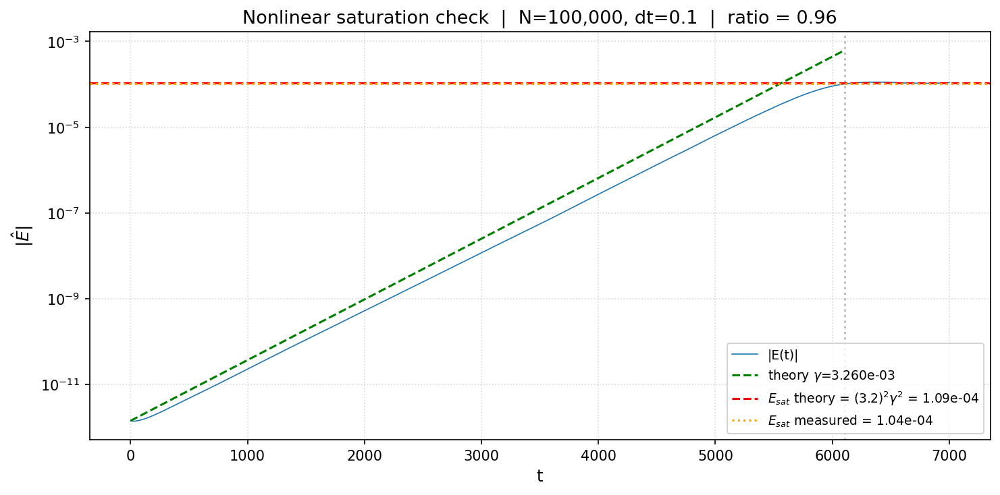
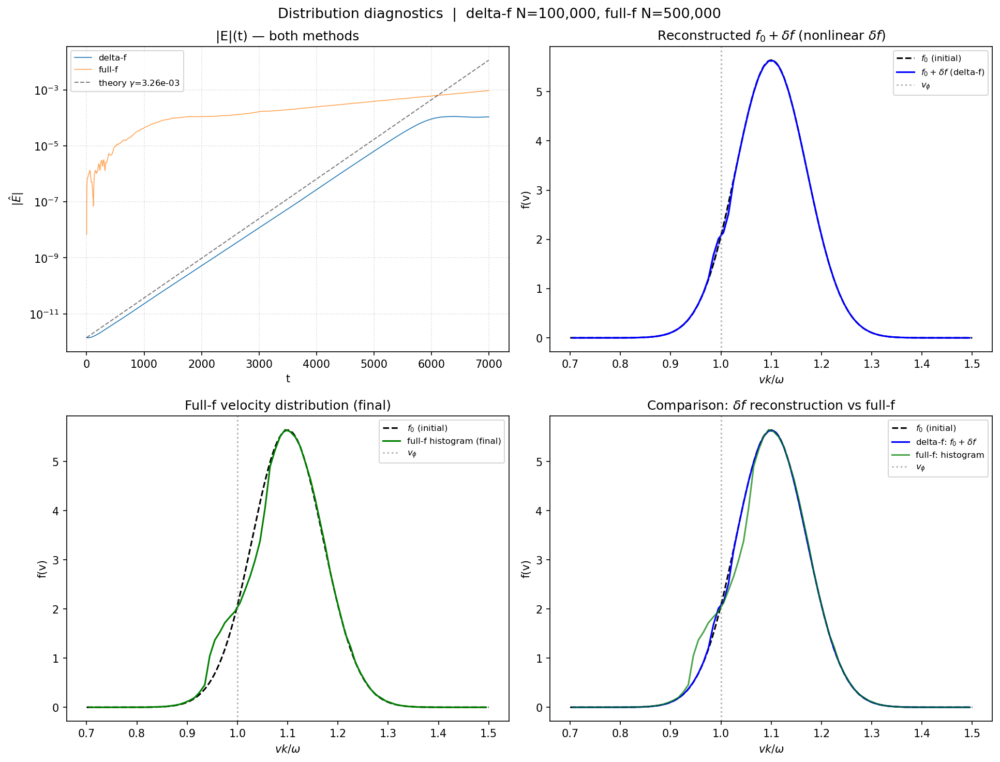
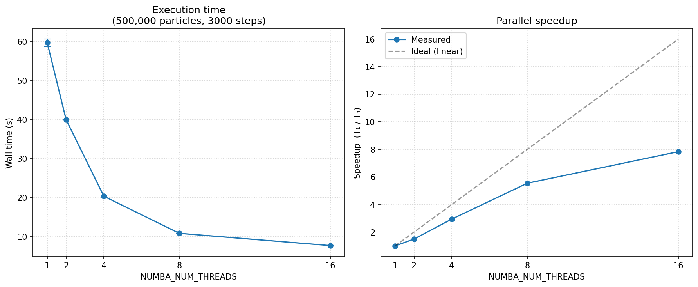

# WISP Beam–Plasma Simulation: Delta-f Method

A 1D electrostatic particle-in-cell simulation studying the bump-on-tail instability using the [WISP](https://github.com/ejpaul/wisp_proto) framework. This project implements both **full-f** and **delta-f** particle methods, validates nonlinear saturation theory, and demonstrates Numba-based parallel scaling.

Developed as part of the Spring 2026 Plasma Physics research project at Columbia University.

---

## Physics Overview

We simulate a warm electron beam streaming through a cold background plasma. The beam is initialized as a Maxwellian centered at velocity $u_b = 1.1$ with thermal width $v_b = 0.1$ and density fraction $n_b/n_e = 5 \times 10^{-5}$. The system is unstable to the bump-on-tail instability, which drives exponential growth of the electrostatic field at the predicted linear growth rate

$$\gamma = -\sqrt{\pi}\;\frac{n_b}{n_e}\;\frac{(1 - u_b)}{v_b^3}\;\exp\!\left(-\frac{(1 - u_b)^2}{v_b^2}\right)$$

and saturates at the nonlinear amplitude $E_{\text{sat}} = (3.2)^2 \gamma^2$.

---

## What's in This Repository

| File | Purpose |
|------|---------|
| `core.py` | Main simulation engine — particle pushers, field update, time-stepping loop. Supports linear and nonlinear delta-f, full-f, Strang/Trotter splitting. Numba `@njit(parallel=True)` enabled. |
| `saturation_and_scans.py` | **Goal 1 & 2:** Runs nonlinear delta-f simulations to confirm the saturated amplitude prediction, then performs convergence scans over particle count and time step. |
| `distribution_diagnostics.py` | **Goal 3:** Runs both delta-f and full-f simulations, reconstructs the full distribution function from delta-f weights, and compares with full-f histograms. |
| `parallel_scaling.py` | Thread scaling study — measures wall time vs. `NUMBA_NUM_THREADS` and produces speedup curves. |
| `diagnostics.py` | Utility functions: analytic growth rate, velocity distribution plotting. |

---

## Key Results

### 1. Saturated Amplitude Confirmed

The nonlinear delta-f simulation confirms the theoretical saturation amplitude with a measured-to-theory ratio of **0.96**.



The blue curve tracks the theoretical growth rate (green dashed) through the linear phase, then levels off at the predicted $E_{\text{sat}} = (3.2)^2 \gamma^2$ (red dashed line).

### 2. Distribution Function Reconstruction

The delta-f method decomposes the distribution as $f = f_0 + \delta f$, where each particle carries a weight $w_i = \delta f / f_0$. The full distribution is reconstructed as:

$$f(v) = f_0(v)\;\bigl[1 + \langle w \rangle(v)\bigr]$$

where $\langle w \rangle(v)$ is the mean particle weight in each velocity bin.



The full-f simulation (bottom-left) shows a clear **quasilinear plateau** at the phase velocity $v_\varphi = 1.0$ — the signature of wave–particle trapping and the mechanism behind saturation.

### 3. Parallel Scaling

Numba `prange` parallelization of the particle pushers achieves **~8× speedup at 16 threads** (500k particles, 3000 steps), with near-linear scaling up to 4 threads and diminishing returns beyond 8 due to Amdahl's Law.



---

## Methods

### Delta-f vs Full-f

- **Full-f**: Each particle directly samples the physical distribution. Simple but noisy — discrete particle noise acts as a large initial perturbation, causing premature saturation.
- **Delta-f**: Particles carry weights tracking only the perturbation $\delta f$. Weights start at zero, so there is no initial noise. This allows clean resolution of growth rates from seeds as small as $10^{-12}$.
- **Linear delta-f**: Particle velocities are fixed (unperturbed orbits). Captures exponential growth but not saturation.
- **Nonlinear delta-f**: Velocities are updated, and the weight equation includes a $(1 - w)$ feedback term. Captures both growth and saturation.

### Time Integration

The particle–field system is advanced using **Strang splitting** (second-order): half field step, full particle step, half field step. This provides second-order accuracy in the time step compared to first-order Trotter splitting.

### Parallelization

The core particle loops (`push_particles_*` and `compute_current_fourier`) use Numba's `@njit(parallel=True)` with `prange` for thread-level parallelism. The thread count is controlled via the `NUMBA_NUM_THREADS` environment variable, which must be set before importing Numba.

---

## Usage

### Quick test runs

```bash
python saturation_and_scans.py --quick
python distribution_diagnostics.py --quick
```

### Full production runs

```bash
python saturation_and_scans.py
python distribution_diagnostics.py
```

### Parallel scaling study

```bash
python parallel_scaling.py --n-particles 500000 --n-steps 3000
```

---

## Dependencies

- Python 3.10+
- NumPy
- Matplotlib
- Numba
- tqdm

Install with:

```bash
pip install numpy matplotlib numba tqdm
```

---

## Documentation

A detailed LaTeX document describing the delta-f method, weight equation derivation, and distribution reconstruction procedure is available in `delta_f_documentation.tex` (for Overleaf).
